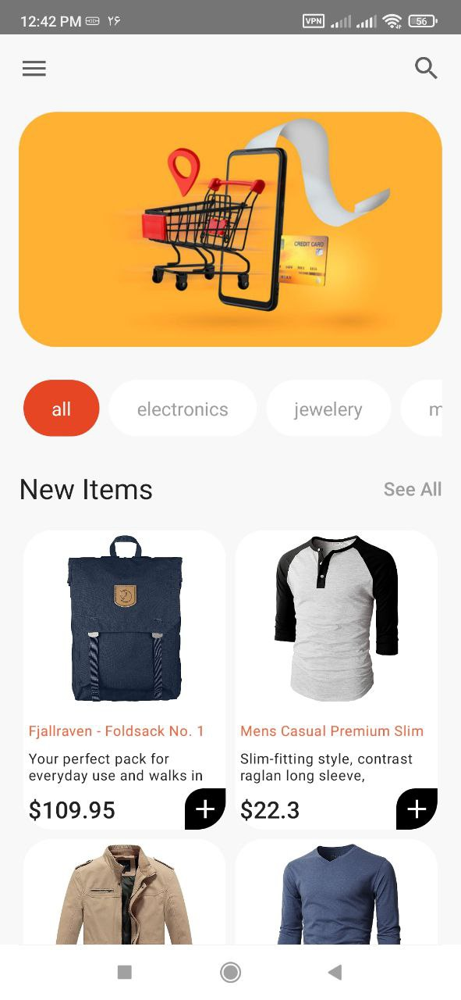
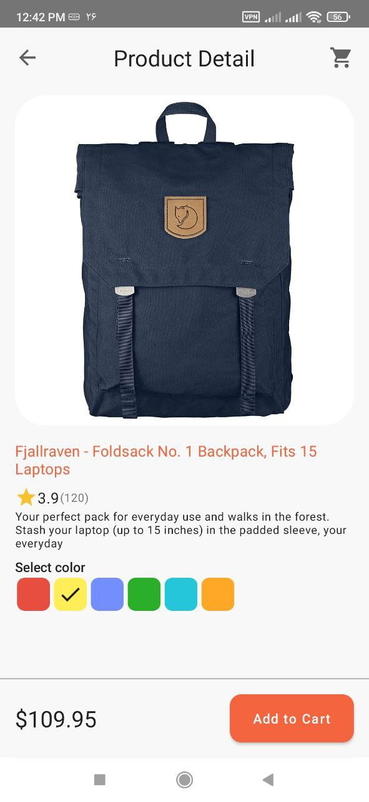

# Shopping App (Compose Multiplatform mobile application)

Welcome to the documentation for the Jetpack Compose Multiplatform Shopping Application! 
This is a cross-platform application that is built using Jetpack Compose Multiplatform, a declarative framework for sharing UIs across multiple platforms with Kotlin. 
The application allows users to browse, search, and purchase products from a shopping catalog on Android, iOS, and desktop platforms.

## Architecture
The Jetpack Compose Multiplatform Shopping Application is built using the Clean Architecture and the MVI (Model-View-Intent) pattern. 
The application is divided into the following layers:

**Presentation**: This layer includes the Jetpack Compose user interface components and logic. 
It's also responsible for mapping data from the domain layer into a format that can be displayed by the user interface.

**Domain**: This layer includes the business logic and use cases of the application. It's also responsible for defining the data models and the repository interfaces.

**Data**: This layer includes the repository implementation that fetches data from the https://fakestoreapi.com server using Ktor.

## Screenshots

### Android

| Main                   | Detail                 |
|------------------------|------------------------|
|  |  |

### IOS

### Desktop

## Contributing
Contributions are welcome! If you find a bug or would like to create a new feature, please submit a pull request.

## License
This library is licensed under the MIT License. See [LICENSE.txt](https://github.com/razaghimahdi/ShopKmp01)

### more ideas:
https://github.com/JetBrains/compose-multiplatform-ios-android-template
https://github.com/JetBrains/compose-multiplatform

Developed by Mahdi Razzaghi Ghaleh